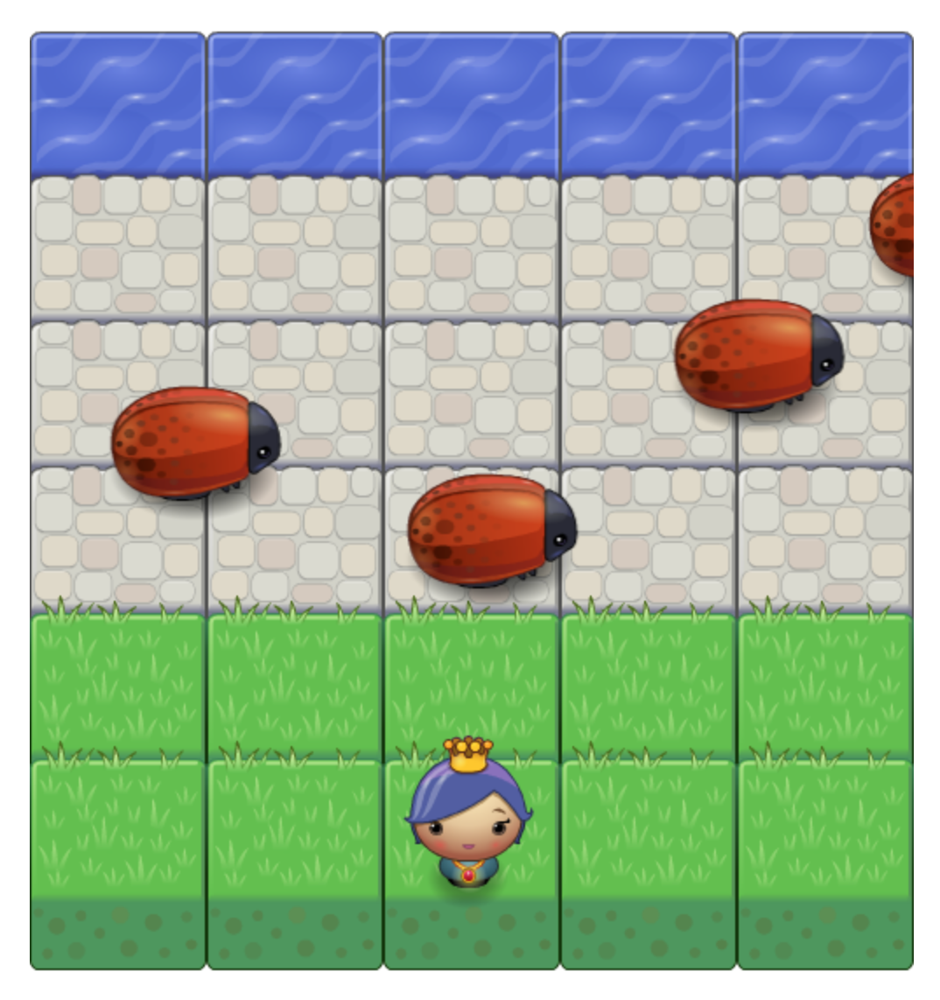

# Classic Arcade Game Clone Project
## Description
This is a clone fo the classic arcade game Frogger.

## Game Rules
The game involves a Player and Enemies(bug). The goal is cross the brick path without colliding with the enemy and reach the water.
The player can move left, right, up and down using the keyboard arrow keys.The bugs move at varying speeds on the brick road. If the player collides with the bug, the player returns to the starting square and the game starts over.

Once the player reaches the water, a pop up message appears and you can play the game again by clicking the X or anywhere on the screen 

**Game board**

## Technical

This game is built as an npm project and mainly consists of the following assets:

* **index.html** - contains the game's html structure.
* **style.css** - contains the game's board styling.
* **app.js** - contains all the board actions & logic.
* **engine.js** - provides the game loop functionality.
* **resources.js** - provides utility functions for loading game assets.

## How to Play
### Click the link :
(https://alynea.github.io/arcade-game/index Arcade Game)

OR

### Run Locally
1.Clone this project: git clone (https://github.com/alynea/arcade-game)
2.cd arcade-game-master
3.Open index.html in a browser
